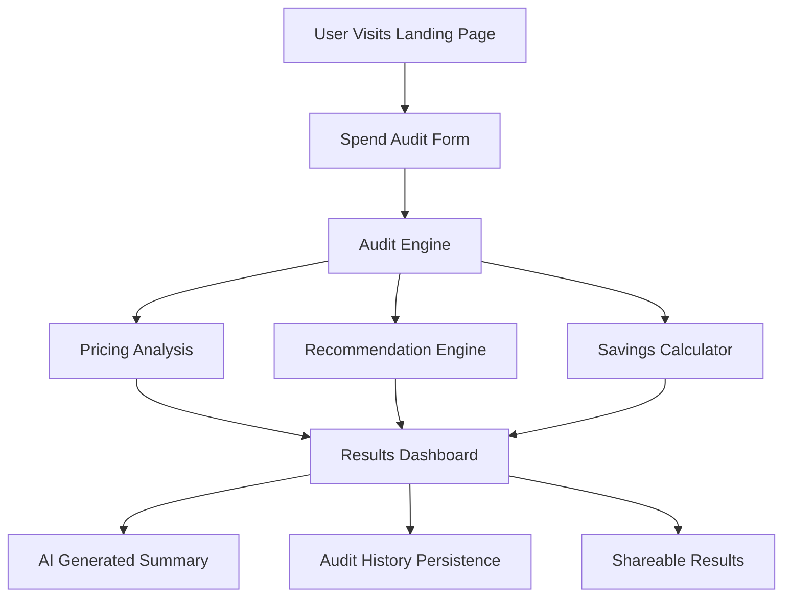

# Architecture Overview

## Stack Choice

### Frontend
- Next.js
- TypeScript
- Tailwind CSS
- Recharts

### Testing & CI
- Vitest
- GitHub Actions

### Deployment
- Vercel

---

# Why I Chose This Stack

I chose Next.js because it provides production-ready routing, fast deployment, React Server Component support, and an excellent developer experience for rapidly shipping SaaS products.

TypeScript was used to improve maintainability and reduce logic errors in the audit engine.

Tailwind CSS enabled rapid UI iteration while maintaining responsive layouts and consistent styling.

Recharts was selected for lightweight spend visualization and analytics dashboards.

Vitest was used because it integrates cleanly with modern TypeScript projects and provides fast testing performance.

Vercel was chosen because it provides seamless deployment for Next.js applications with minimal infrastructure setup.

---

# System Architecture

---

# Data Flow

## 1. User Input

The user enters:
- AI tools used
- subscription plans
- monthly spend
- number of seats
- team use cases

The form data is managed using React state.

---

## 2. Local Persistence

Audit form data is stored in localStorage so the user can refresh the page without losing progress.

This improves usability for longer audit sessions.

---

## 3. Audit Engine Processing

The audit engine evaluates:
- overspending risks
- incorrect plan sizing
- downgrade opportunities
- alternative tool recommendations
- projected savings

The engine uses deterministic business logic rather than AI-generated financial reasoning.

This improves:
- explainability
- predictability
- debugging
- pricing transparency

---

# Audit Logic Philosophy

I intentionally avoided using AI for core financial calculations.

LLMs can generate inconsistent reasoning for pricing optimization, which creates trust issues in financial tooling.

Instead:
- business rules are deterministic
- savings calculations are reproducible
- recommendations remain transparent

AI is only used for personalized summary generation.

---

# Results Dashboard

The results page displays:
- total monthly savings
- annual savings projections
- recommendation breakdowns
- audit insights
- spending visualizations

Charts are rendered using Recharts.

---

# Testing Strategy

Vitest unit tests validate:
- savings calculations
- recommendation logic
- overspending detection
- audit output consistency

GitHub Actions automatically runs linting and tests on every push to main.

---

# Scaling Plan for 10k Audits/Day

If this product scaled significantly, I would:

## Infrastructure
- migrate persistence to PostgreSQL/Supabase
- introduce Redis caching
- add CDN edge caching
- move AI generation into async jobs

## Reliability
- add API rate limiting
- implement monitoring with Sentry
- add analytics instrumentation
- improve fault tolerance

## Product
- add authentication
- support organization dashboards
- implement PDF exports
- introduce benchmarking against similar startups

---

# Tradeoffs

## Simplicity vs Scalability

I prioritized shipping a functional MVP quickly rather than prematurely optimizing infrastructure.

---

## Deterministic Logic vs AI Reasoning

Hardcoded pricing rules are more reliable and explainable than fully AI-generated audit recommendations.

---

## localStorage vs Database

localStorage was sufficient for MVP persistence while reducing backend complexity during rapid iteration.

A production deployment would migrate audit history into a real database.

---

# Future Improvements

- Real-time AI pricing APIs
- Benchmark analytics
- Organization-level dashboards
- Multi-user collaboration
- PDF export generation
- Email report delivery
- Public audit sharing with Open Graph previews